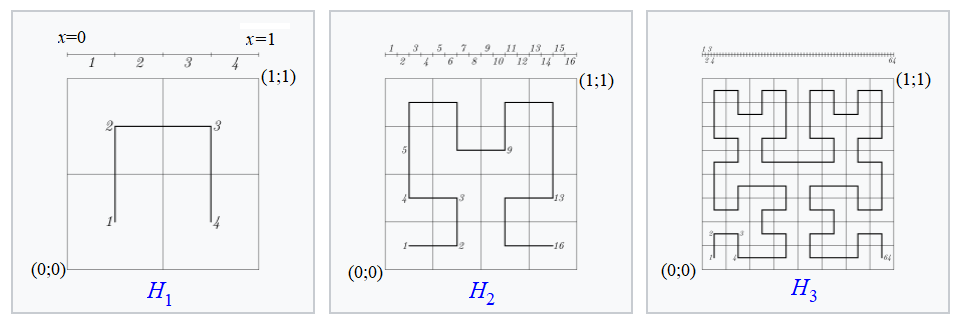
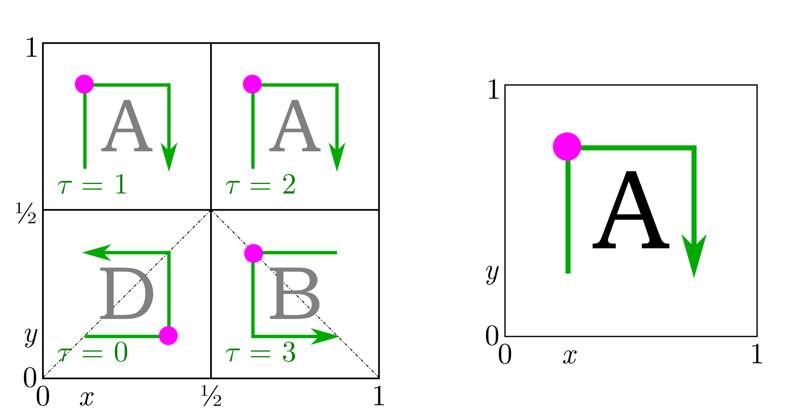

Lauztas līnijas un šahs
===============================

Hilberta līkne
----------------

Definēsim rekursīvi līknes :math:`H_k(t)`.

Attēlā redzamas līknes :math:`H_1(t)`, :math:`H_2(t)` un :math:`H_3(t)`.
Par līkni šeit saukta funkcija, kas definēta skaitļiem
:math:`t \in [0;1]`, bet vērtības ir skaitļu pāri :math:`(x,y)`
jeb punkti vienības kvadrātā :math:`[0;1] \times [0;1]`.

Līkni :math:`H_1(t)` vispirms definējam vērtībām
:math:`{\displaystyle t \in \left\{ 0, \frac{1}{3}, \frac{2}{3}, 1 \right\}}`.
Sadalām kvadrātu :math:`[0;1] \times [0;1]` četros mazākos kvadrātos
un skaitļus :math:`\{ 0, 1/3, 2/3, 1 \}`
attēlojam uz mazo kvadrātu centriem :math:`(\frac{1}{4}, \frac{1}{4})`,
:math:`(\frac{1}{4}, \frac{3}{4})`, :math:`(\frac{3}{4}, \frac{3}{4})` un  :math:`(\frac{1}{4}, \frac{1}{4})`.
Visām citām vērtībām :math:`t \in [0;1]` līkne ar
nemainīgu ātrumu pārvietojas starp norādītajiem punktiem.
Līknes vienādojumu var uzrakstīt kā sistēmiņu, šķirojot gadījumus:

.. math::

  H_1(t) = \left\{ \begin{array}{ll}
  (\frac{1}{4}, \frac{1}{4}), & \mbox{if $z=0$}\\
  (\frac{1}{4}, 3 \cdot (\frac{1}{3} - t) \cdot \frac{1}{4} + 3 \cdot (t - 0) \cdot \frac{3}{4}), & \mbox{if $z \in (0/3;1/3)$}\\
  (\frac{1}{4}, \frac{3}{4}), & \mbox{if $z = 1/3$}\\
  (3 \cdot (\frac{2}{3} - t) \cdot \frac{1}{4} + 3 \cdot (t - \frac{1}{3}) \cdot \frac{3}{4}), & \mbox{if $z \in (1/3;2/3)$}\\
  (\frac{3}{4}, \frac{3}{4}), & \mbox{if $z  = 2/3$}\\
  (\frac{3}{4}, 3 \cdot (1 - t) \cdot \frac{3}{4} + 3 \cdot (t - \frac{2}{3}) \cdot \frac{1}{4}), & \mbox{if $z \in (2/3;1)$}\\
  (\frac{3}{4}, \frac{1}{4}), & \mbox{if $z = 1$}\\
  \end{array} \right.

Līknei :math:`H_2(t)` sadalām nogriezni piecpadsmit vienādās daļās
ar :math:`16` punktiem:

.. math::

  t \in \left\{ 0, \frac{1}{15}, \frac{2}{15}, \ldots, \frac{14}{15}, 1 \right\}

Katru no šiem punktiem attēlojam par kādu no :math:`4 \times 4` mazo kvadrātiņu centriem,
kuros sagriežam vērtību apgabalu -- kvadrātu :math:`[0;1] \times [0;1]`.
Katrā no intervāliem līkni velk kā taisnes nogriezni ar nemainīgu ātrumu.

.. math::

  H_2(t) = \left\{ \begin{array}{ll}
  (\frac{1}{8}, \frac{1}{8}), & \mbox{if $z = 0$}\\
  (15 \cdot (\frac{1}{15} - t) \cdot \frac{1}{8} + 15 \cdot (t - 0) \cdot \frac{3}{8}, \frac{1}{8}), & \mbox{if $z \in (0;1/15)$}\\
  (\frac{3}{8}, \frac{1}{8}), & \mbox{if $z = 1/15$}\\
  \ldots & \\
  (\frac{7}{8}, \frac{7}{8}), & \mbox{if $z = 1$}\\
  \end{array} \right.

Līdzīgi arī citām līknēm :math:`H_k` -- intervālu
:math:`[0;1]` sadala :math:`2^{2k} - 1` vienādās daļās.
Sadala arī kvadrātu :math:`[0;1] \times [0;1]` mazākos kvadrātiņos: :math:`2^k \times 2^k`
un vienmērīgā ātrumā apstaigā šo kvadrātiņu centrus.

Secība, kādā līkne apstaigā mazos kvadrātiņus, veidojas rekursīvi.
Līknei :math:`H_1` šī secība ir kā pakavs :math:`(1/4,1/4), (1/4,3/4), (3/4,3/4), (3/4, 1/4)`,
bet katru nākamo iegūst no iepriekšējās:
Secību līknei :math:`H_{k+1}` veido no četrām līknes :math:`H_k` kopijām, kuras
visas ir samazinātas ar līdzības koeficientu :math:`0.5` un pagrieztas tā, kā redzams zīmējumā.

Pašu Hilberta līkni (tās vērtību argumentam :math:`t \in [0;1]`) definē ar robežu:

.. math::

  H(t) = \lim_{n \rightarrow \infty} H_n(t).

Var pamatot, ka visu funkciju :math:`H_k(t)` virkne konverģē vienmērīgi visā intervālā.

Aplūkojam funkciju :math:`x = H_x(t)`, kura atrod :math:`x`-koordināti līknei :math:`H(t)`.

* Uzzīmēt grafiku funkcijai :math:`x = H_x(t)` ar Python Matplotlib vai līdzīgu rīku.
* Parādīt, ka :math:`t \mapsto H_x(t)` ir nepārtraukta funkcija.
* Parādīt, ka :math:`t \mapsto H_x(t)` ir vienmērīgi nepārtraukta funkcija un
  noteikt, kā dotajam :math:`\varepsilon>0` var atrast :math:`\delta >0` tā, lai
  argumentiem :math:`t_1,t_2`, kam :math:`|t_1 - t_2| < \delta` izpildās
  :math:`|H_x(t_1) - H_x(t_2)| < \varepsilon`.

.. only:: Internal

  **Atbilde:**

  Vispirms uzzīmējam
  koordinātes Hilberta līknes tuvinājumiem :math:`H_1(t)`,
  :math:`H_2(t)`, :math:`H_3(t)`. Pēc tam (pa labi) attēlojam grafiku pašas
  Hilberta līknes projekcijai uz :math:`x` ass.

  .. plot:: figs-polylines-and-chess/hilbert_projection_limit.py
     :include-source: false
     :width: 8in

  :math:`\square`

Šaha dāmu novietošana
----------------------

Dots :math:`12 \times 12` šaha galdiņš. Kā izvietot tajā :math:`12` šaha dāmas tā,
lai tās neapdraudētu viena otru (neatrastos uz tās pašas horizontāles, vertikāles
vai diagonāles).

.. plot:: figs-polylines-and-chess/chessboard.py
   :include-source: false
   :width: 5in
